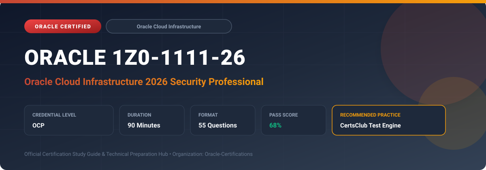

  

# Oracle 1Z0-1111-26: Oracle Cloud Infrastructure 2026 Security Professional

---

## 1. Exam Overview & Candidate Profile

The **Oracle 1Z0-1111-26: Oracle Cloud Infrastructure 2026 Security Professional** certification validates expert capabilities in designing, configuring, and maintaining secure multi-tier enterprise cloud environments on OCI.

Candidates validate comprehensive knowledge in IAM Identity Domains, Cloud Guard, Security Zones, OCI Vault, Web Application Firewall (WAF), Bastion, Network Security Groups, Vulnerability Scanning, and Data Safe.

### Target Audience & Prerequisites
- **Target Roles**: Implementation Specialists, Cloud Architects, Technical Leads, Enterprise Consultants, and Systems Engineers.
- **Recommended Experience**: 1–2 years of practical, hands-on experience designing, implementing, and maintaining corresponding Oracle solutions.
- **Credential Earned**: OCP Certification.

---

## 2. Key Exam Specifications

| Specification | Details |
| :--- | :--- |
| **Exam Code** | **Oracle 1Z0-1111-26** |
| **Official Title** | Oracle Cloud Infrastructure 2026 Security Professional |
| **Certification Track** | Oracle Cloud Infrastructure |
| **Exam Duration** | 90 Minutes |
| **Number of Questions** | 55 Questions |
| **Passing Score** | 68% |
| **Question Format** | Multiple Choice (Single/Multiple Answer), Scenario-Based Questions |
| **Delivery Provider** | Oracle University / Pearson VUE (Online Proctored or Test Center) |
| **Recommended Practice Engine** | [CertsClub Oracle Practice Tests](https://www.certsclub.com/oracle/1z0-1111-26-dumps.html) |

---

## 3. Official Blueprint & Exam Domain Breakdown

The examination assesses candidate competencies across core functional domains weighted as follows:

| Domain Area | Weighting |
| :--- | :--- |
| **Identity & Access Management (IAM) with Identity Domains** | `25%` |
| **Cloud Guard, Security Zones & Posture Management** | `25%` |
| **Data Protection, Encryption & OCI Vault** | `20%` |
| **Network Security, Firewalls (WAF) & Bastion** | `20%` |
| **Vulnerability Scanning & Oracle Data Safe** | `10%` |

---

## 4. Deep Dive into Complex & Challenging Technical Topics

To secure a passing score on the 1Z0-1111-26 exam, candidates must master the following advanced concepts:

- Configuring IAM Identity Domains, multi-factor authentication (MFA), sign-on policies, and dynamic groups.
- Implementing Cloud Guard detector recipes and automated responder actions.
- Enforcing non-negotiable security baselines using OCI Security Zones.
- Managing Master Encryption Keys (MEK) and software/Hardware Security Module (HSM) keys in OCI Vault.
- Deploying edge and regional Web Application Firewall (WAF) with OWASP protection and rate limiting.

---

## 5. Scenario-Based Demo & Practice Questions

### Question 1
An enterprise requires that developers cannot create compute instances with public IP addresses or create unencrypted Object Storage buckets in a specific compartment. Which OCI service provides strict preventative policy enforcement?

A) OCI Security Zones
B) Cloud Guard Detector Recipes
C) Network Security Groups
D) Vulnerability Scanning Service

- **Correct Answer**: `A) OCI Security Zones`  
- **Technical Explanation**: OCI Security Zones enforce strict preventative security policies. Any resource creation or modification that violates security zone policies is immediately denied at the API layer.

---

### Question 2
In OCI Identity Domains, what mechanism allows compute instances to authenticate against OCI APIs without hardcoding API keys or credentials in application code?

A) Dynamic Groups and Instance Principal authentication
B) Static API Key generation
C) Bastion session tokens
D) Local user password credentials

- **Correct Answer**: `A) Dynamic Groups and Instance Principal authentication`  
- **Technical Explanation**: Dynamic groups bundle instances matching rule criteria (e.g., compartment ID). IAM policies can then grant permissions to the dynamic group, enabling instances to act as principals.

---

## 6. Recommended Preparation Strategy & Practice Testing Engine

Achieving certification in **Oracle 1Z0-1111-26** requires balanced theoretical study and scenario-based simulation practice:

1. **Review Oracle Documentation**: Master architecture guides, implementation workbooks, and administration manuals on the Oracle Help Center.
2. **Hands-on Lab Practice**: Execute real-world configuration, policy setup, and troubleshooting tasks in your cloud tenancy or test instance.
3. **Simulated Exam Drills**: Practice answering timed, scenario-based multiple-choice questions to familiarize yourself with the question formats, traps, and timing constraints.

### Practice With CertsClub
For realistic practice questions, updated dumps, and mock testing environments:
- **Resource**: [CertsClub Oracle Practice Test Engine](https://www.certsclub.com/oracle/1z0-1111-26-dumps.html)
- **Special Discount**: Use coupon code **`club20`** during checkout for an instant **20% discount** on all practice exam bundles and testing engines.

---

## 7. Official Documentation & References

- [Oracle University Certification Registry](https://education.oracle.com/)
- [Oracle Help Center Documentation Portal](https://docs.oracle.com/)
- [Oracle Cloud Infrastructure & Applications Guides](https://docs.oracle.com/en/cloud/)
- [CertsClub Oracle Certification Exam Practice](https://www.certsclub.com/oracle/1z0-1111-26-dumps.html)

---

## 8. SEO & Discovery Keywords

`oracle 1z0-1111-26, oracle 1z0-1111-26 exam, oracle 1z0-1111-26 dumps, 1Z0-1111-26 practice questions, 1Z0-1111-26 study guide, oracle cloud infrastructure 2026 security professional, certsclub 1z0-1111-26`